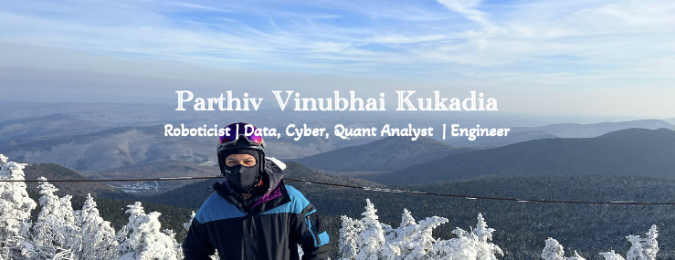

  

## Introducing Parthiv 🕺

<!--
**Parthiv-V-Kukadia/Parthiv-V-Kukadia** is a ✨ _special_ ✨ repository because its `README.md` (this file) appears on your GitHub profile.

Here are some ideas to get you started:

- 🔭 I’m currently working on ...
- 🌱 I’m currently learning ...
- 👯 I’m looking to collaborate on ...
- 🤔 I’m looking for help with ...
- 💬 Ask me about ...
- 📫 How to reach me: ...
- 😄 Pronouns: ...
- ⚡ Fun fact: ...
-->
<h3>👨🏻‍💻  About Me  👨🏻‍💻</h3>
👋 Hi, I'm Parthiv Vinubhai Kukadia, a passionate data analyst, engineer, and roboticist. 

- 🤖 A Robotics Postgraduate at the National University of Singapore, specializing in autonomous robot navigation and mobile robotics.
- 🎓 A Bachelor's degree in Aerospace Engineering and Economics from the University of Illinois at Urbana-Champaign
- 🛰️ Experience in robotics design, autonomous navigation, and developing UAVs and satellites.
- 📊 Have a quantitative background, being a data analyst developing servers, performing data analytics through automated algorithms, and creating data visualization dashboards.
- 🔒 Experience working in cybersecurity, leading a utility firm’s journey to being cyber resilient by developing processes to protect the business functions into a cyber vault and defining governance practices.
- 💡 Strong analytical and problem-solving skills, thriving in roles that demand being calm in high-stress situations, critical thinking, and innovative solutions.
- ⚙️ Enjoy working on projects that push boundaries in both robotics and quantitative analysis.
- 🌍 Adaptable and resilient, having grown up in fast-paced cities like Bangkok, Hong Kong, Mumbai, Chicago, NYC, and Singapore.
- 🎿 Adrenaline junkie, passionate about skiing, scuba diving, bouldering, and adventure sports.

🚀 Currently exploring exciting opportunities in UAV technologies, autonomous navigation, and quantitative roles! 📊✈️  

  <a href="https://drive.google.com/file/d/18klxfiX1CSB2vlVTt3ubyNI6Tesr31Si/view?usp=sharing">📄 You can check out my CV here. 📄</a>

  <!-- Add a gap here -->

<h3>🛠 Tech Stack 🛠</h3>

  <h4 style="display: inline; margin-right: 20px;"> 💻 Languages</h4>
  

  <h4 style="display: inline; margin-right: 20px;"> 🗄 Databases</h4>
  

  <h4 style="display: inline; margin-right: 20px;"> 🏗️ Computer Aided Design</h4>
  

  <h4 style="display: inline; margin-right: 20px;"> 🖥 Microsoft Suite Skills</h4>
  

  <!-- Add a gap here -->

<h3>🤖 Robotics 🦾</h3>

<h4>Skills Overview</h4>

| Deep Learning for Computer Vision       | Control Systems                   | Localization and Mapping                | Mechanics and Robot Motion Analysis | Hardware       |
|:----------------------------------------:|:----------------------------------:|:----------------------------------------:|:-----------------------------------:|:--------------:|
| 1. Self-Organizing Maps (SOM)           | 1. Control Theory                 | 1. Simultaneous Localization and Mapping (SLAM) | 1. Robot Kinematics                | 1. Raspberry Pi  |
| 2. Multilayer Perceptron (MLP)         | 2. Motion Planning                | 2. Monte Carlo Localization              | 2. Robot Dynamics                   |                |
| 3. Convolutional Neural Networks (CNN)  | 3. Linear Quadratic Regulator (LQR) |                                          |                                   |                |
| 4. Support Vector Machines (SVM)        | 4. Kalman Filter (KF)            |                                          |                                   |                |
| 5. Reinforcement Learning (RL)          | 5. Extended Kalman Filter (EKF)  |                                          |                                   |                |
| 6. Deep Q-Networks  (DQN)                |                                  |                                          |                                   |                |

  <!-- Add a gap here -->
<h3>⚙️ My GitHub Analytics ⚙️</h3>

<h4>📊 My GitHub Statistics</h4>

<h4>💻 My Programming Languages</h4>

  <!-- Add a gap here -->
<h3>🤝🏻  Connect with Me  🤝🏻</h3>

  
  
  
  
  

